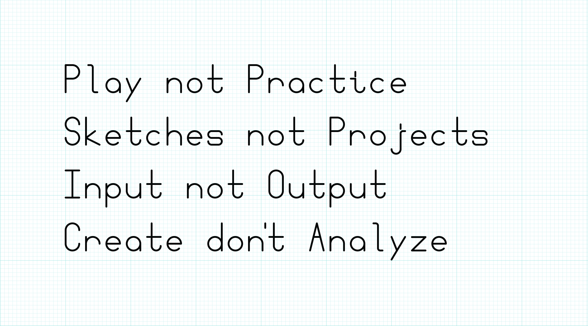
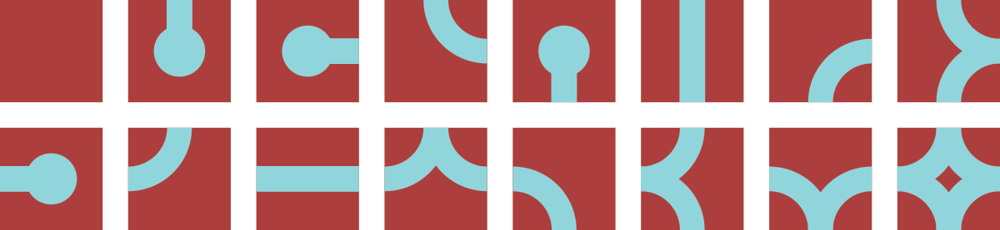
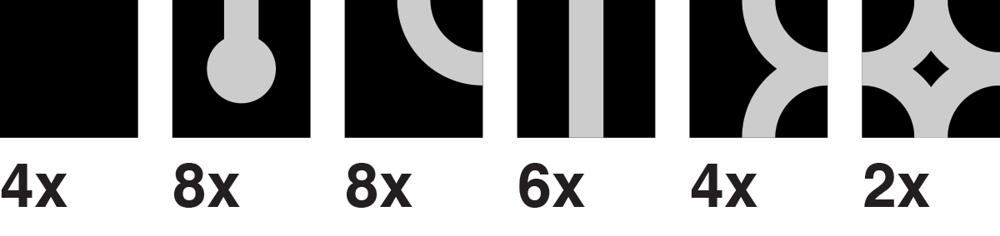

# Activity: Sierpinski Triangle

[Draw a Sierpinski Triangle](sierpinski.html)

The [Sierpinski Triangle](http://en.wikipedia.org/wiki/Sierpinski_triangle) is a fractal set. It is infinitely detailed and self-similar. There are many, many ways to generate a Sierpinski Triangle. The amazing [sierpinski triangle page to end most Sierpinski triangle pages](http://www.oftenpaper.net/sierpinski.htm) details many of them.

# What Comp Form Is

> Q: Can the computer substitute for the Designer?
>
> A: Probably, in some special cases, but usually the computer is an aid to the Designer.
>
— Charles Eames, Design Q&A ([Transcript](http://www.markwunsch.com/eames.html))

This is a class about computational form, algorithmic images, generative art, parametric design, and procedural generation. In this class, we will explore a creative process in which form is made by following defined processes. We will write instructions that a computer will follow to create images, animations, sounds, and sculptures. **We will make things that make things.**

There are many reasons artists and designers employ algorithmic methods, some important ones include:

- exploring new aesthetic
- automating complex tasks
- enhancing variety
- creating dynamic content

While we use computer programming throughout this class, it is important to understand that procedural generation is about defining instructions that create form. Computers are very useful tools for carrying out these instructions, but artists have also built systems that rely on humans or purpose-built machines instead.

## Who I am

I am Justin Bakse. I am interaction designer and teacher at Parsons. [This is my site](http://justinbakse.com/). I am personally very interested in computational form and have used computational methods in a great deal of my work.

[Research Project Slides](who_i_am.html)

# Slides: Examples of Comp Form

Computational Form is form (image, animation, music) that results from following a set of instructions.

[Comp Form Example Slides](what_comp_form_is.html)

# About this Class

## Learning Objectives
In this class, we will make things that make things. We will work with a variety of programming languages, tools, and methods to create a wide variety of output: graphics, sounds, videos, animations, even 3D printed objects. The primary goals of this class are to introduce new ways of making and to encourage aesthetic exploration.

Along the way we'll use a variety of programming languages and tools:
- Javascript
- p5.js
- paper.js
- OpenSCAD
- Vuo

We will also explore some interesting programming topics including:
- pseudo-random numbers
- Perlin noise
- proc-gen strategies and tactics
- Markov chains
- alternative programming paradigms
- GPU vs CPU pipelines
- just a bit of machine learning

## Class Format + Homework

This class focuses on exploration. Each class introduces a new topic or tool, usually with an in-class workshop. Throughout the week you will be expected to create daily sketches/experiments related to that topic. **This emphasis on this class will be on personal exploration, learning to learn, and process rather than outcomes.**

## Notes on Daily Sketching
Your goal each day should be to explore a different aspect of the weekly theme. Ideally, you will spend 1 to 2 hours on an idea, resulting in an image or other artifact. Each day you will work on a different idea, possibly informed by something you did early in the week/class.

> So I have to post something **every single day**?

The spirit of the assignment is daily practice, with some flexibility. Five posts a week that explore the weekly theme in a variety of ways is considered "A" work.

> What if I miss a day?

That is fine, spend more time on another day and post twice.

> Can I spend, say, 8 hours all on one day? Maybe I'll pull an all-nighter.

Don't do that. This process is about exploring different ideas. Spacing out your work gives you time to think. Creativity often comes in the space between acts.

> What if I make something I like in 15 minutes?

Post it. Then keep working. Post again.

> What if I work for a couple hours and don't really like what I've made?

Post it. Then stop working. Try something different tomorrow.

> 1 to 2 hours is too short. Can I work longer?

If after an hour, you feel excited about what you are doing then keep working or make an in-progress post and build on it the next day. If you are frustrated, just post what you've got and move on.

Don't ever put more than 2 hours into a frustrating sketch. Just post what you've got and start fresh on something else the next day.

If you find you often need more than an hour, you might be trying to make things that are too complex.

> Can I post a work in progress and keep working on it tomorrow?

Yes. But don't work on one thing the whole week. Sketch a variety of ideas each week.

> I can't decide what to work on today.

If you have more than one idea, just pick one at random. Don't change your mind, just run with it. You are only investing an hour or two. If you have no ideas, review the class notes, do some Google image searches, be open to *any* idea that pops up. Just run with the first bad idea.

> I can't get whatever technology we are working on this week to work; my computer is broken; I missed class and I'm lost; I'm just lost this week. What should I do?

Keep posting. If you can't do exactly what you want, find something close that you can do and do that. Most weeks you could do pretty interesting projects, that relate to the weekly themes, without even using a computer.

> I'm tired of looking at the computer screen? Can I do a couple of posts with paper/paint/glue/wood/whatever?

Absolutely. **I highly recommend that you do!** The more variety between your posts the better. Do make sure that your work relates to the weekly topic.

> What about in class work?

Some weeks we'll have time set aside in class to make something, some weeks we won't. If we do start something in class, you can finish it after class and post it as one of your sketches.

> Bottom line, how much time do I have to spend on these sketches?

90 minutes is ideal.

Don't put more than 2 hours in on a sketch. If your sketch takes that long it is too complex, or too difficult for your current skill level. It is okay to stop at 2 hours even if your sketch is broken. Post whatever you have, you'll get full marks for the sketch.

Don't put in less than 45 minutes. Sometimes, you'll make a really nice sketch pretty quickly. If that happens, post it! But keep exploring variations on your idea. If you often get done very quickly, you probably need to work on more challenging sketches.

## Prerequisites
In this class, we will be exploring and creating projects in a variety of programming tools and languages, most of which will likely be new to you. To be comfortable in this class, you will need a foundation in a procedural programming language such as Javascript or Processing.

Coming into this class, you should:

- be able to create a coded drawing project in Javascript or Processing from scratch or a template.
- understand the basics of a version control system such as git.
- be comfortable working in Adobe Illustrator and Photoshop.
- be comfortable capturing digital images with a camera and scanner.

That said, this class offers a good deal of flexibility. If you are not sure if you are ready for this class, please speak with me today to make a plan.

## Every Day

- Be early + ready.
- Bring your computer, a sketchbook, a pencil, and a pen.

## Syllabus Review
Please review the [syllabus here](../syllabus.html).

## The Class Sketch Blog

Our class sketch blog will host your daily experiments and links to content of interest to the class.

# Activity: Class Introductions

A few things I'd like to know about the class:

- Have you programmed before?
- Have you programmed in a design context before?
- How well do you know HTML/CSS?
- How well do you know Javascript?
- How well do you know Processing?
- How well do you know git/Github?

# Tile Sets

## Repeating Tiles

Top matches bottom, left matches right.

## Repeating Tiles with Alternates

Top matches bottom, left matches right. Alternate tiles used to break up pattern.

## Rotatable Tiles

Top matches bottom, left matches right. Rotated tiles still match up.

See also: [Truchet Tiles](https://en.wikipedia.org/wiki/Truchet_tiles)

## Edge-matched Tile Sets

A set of tiles where the sides of each tile match up to the opposing side of another tile in the set. Edge-matched tiles are great for forming lines.

One way to create a tile set is to consider each edge to be one of two states: occupied or empty. Since there are 4 sides, and each has two states, there will be 4^2 = 16 tiles in the set.

Depending on the design, some of these tiles may be rotations of other tiles.

In those cases, a smaller set will still work.

With a set of tiles, you can start creating forms.

A wide variety of looks can be created.

See also: [Wang Tiles](https://en.wikipedia.org/wiki/Wang_tile)

## Corner-matched Tile Sets

You can also create a set by considering the corners to be empty or occupied. Corner-matched tiles are great for forming shapes.

## Consider
- How does this method impact design rhythm, complexity, concord, similarity, repetition?
- How are these design different from/similar to patterns?
- What kind of forms does this method lead to naturally? How can this be embraced/avoided?
- What are the essential elements of this method?
- How does a tile kit like this compare to building kits like lego blocks?
- How does a tile kit compare to a font?
- How does working within constraints impact creativity?
- What are the advantages/disadvantages to working by hand?
- How would variations on the tile work? Staggered? Triangles? Rectangles?
- What if each edge/corner had three states instead of two?
- How could these tiles work in 3 dimensions?

# Slides: Tile Sets Examples
- [Tile Sets Examples](tile_reference.html)

# Workshop: Tile Sets
Create and edge-matched tile kit. Use markers on paper squares. Make up a design that allows rotation, this is faster to draw out than a full set. Once you have made your kit, use it to create a variety of forms. Try building out each letter in the alphabet.

The image below shows which tiles you need to make, and how many to make of each.

After playing with your set, start experimenting however you wish. Before the end of the class take a picture of your work and post it the class sketch blog.

# Assignment
This is the first assignment and the beginning of your daily posts.

Daily exercise:
1. Create a new tile set.
2. Use the tile set to create a design.
3. Screengrab or photograph your work and post to the class sketch blog with the hashtag `#tiles`.

Explore a different idea every day, if you need some ideas consider using one of the following as a prompt. If you use one of these prompts, include it in your blog post. `#paper`, `#pixels`, `#vectors`, `#typography`, `#self-portrait`, `#3d`, `#make-things-that-make-things`, `#hexagons`, `#triangles`, `#photocopier`, `#big`, `#huge`, `#edge`, `#corner`, `#pattern`, `#trade`, `#teamwork`, `#stamps`, `#scissors`

For more ideas:
[Brian Eno - Oblique Strategies](https://en.wikipedia.org/wiki/Oblique_Strategies),
[Oblique Strategies Online](http://stoney.sb.org/eno/oblique.html)

## Challenge Prompt (Optional)
Create a font: design a full alphabet using a single tile set. Post an image that shows your font in use.

# Related Links

- [Maze Generation](http://www.jamisbuck.org/mazes/)
- [Wang Tiles](https://en.wikipedia.org/wiki/Wang_tile)
- [Stagecast - Wang Tile Maze Design](http://www.cr31.co.uk/stagecast/wang/intro.html)
- [Greg Schomburg - Two Minute Posters](http://designergroupies.com/twominuteposters/)
- [Immaculate Heart College Art Department Rules](https://www.brainpickings.org/2012/08/10/10-rules-for-students-and-teachers-john-cage-corita-kent/)
- [Redblob's Links](http://www-cs-students.stanford.edu/~amitp/gameprog.html#tiles)
- [What Makes Mathmatics Hard to Learn](http://web.media.mit.edu/~minsky/OLPC-1.html)
- [Explained Visually](http://setosa.io/ev/)

[Today's Plan](plan.html)
