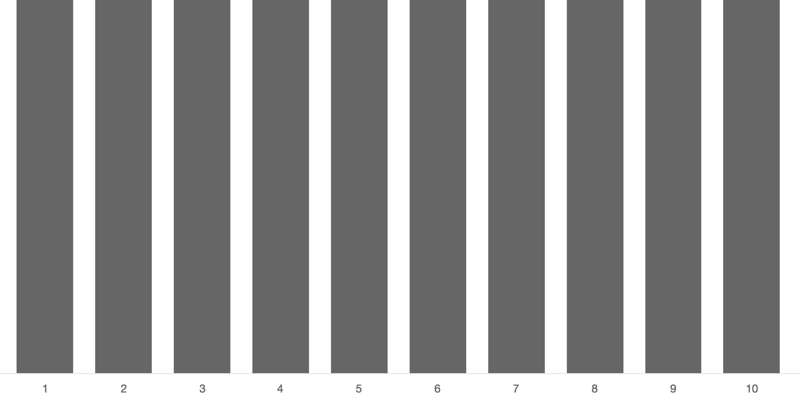
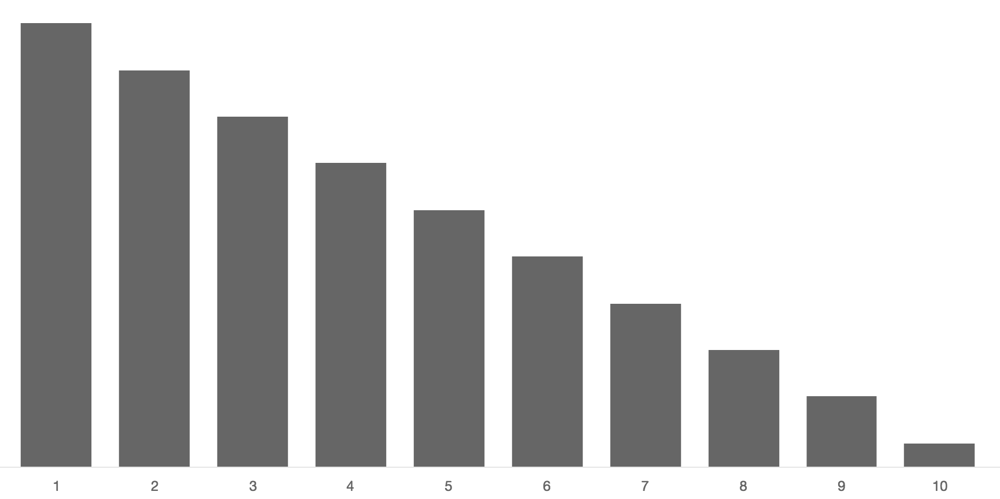
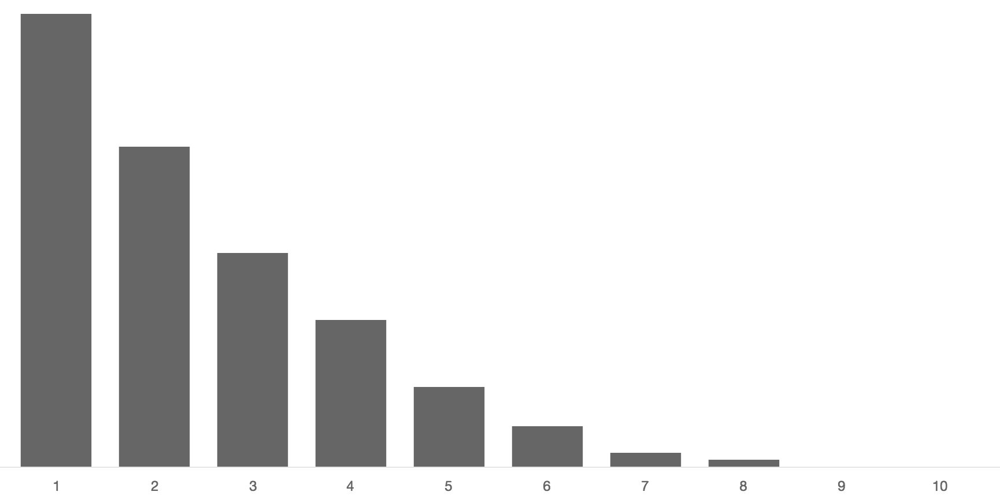
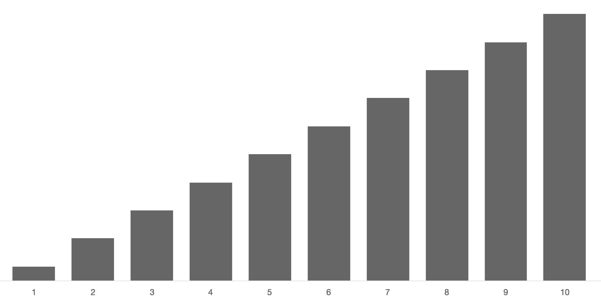
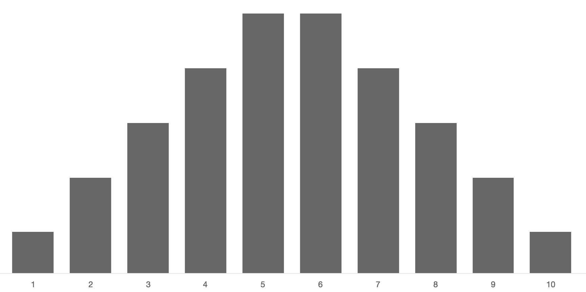
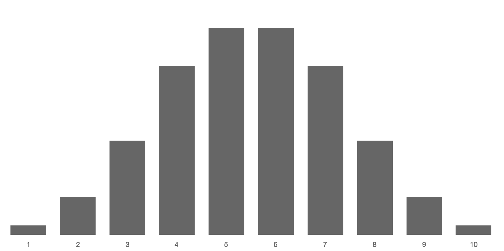

## Activity: 2D6 vs 1D12

[Roll the Dice](dice.html)


# Homework Review

If you see *interesting* work, books, or tools related to the class online. Please do post links to the blog.

**Whenever you post work you didn't make yourself include a link to the source, and if possible the artist's name.**


# Slides: Progen Images

[Procedurally Generated Imagee](slides.html)


# What p5 Is
From the p5js Homepage:

> p5.js is a JavaScript library that starts with the original goal of Processing, to make coding accessible for artists, designers, educators, and beginners, and reinterprets this for today’s web.

P5 is a javascript library for making drawings and animations. It makes getting set up and working faster and provides simple functions for common tasks. It also allows for a more imperative programming style, similar to Processing.

If you have never worked with Processing or p5, you'll need to do some reading and learning on your own. Here are some resources to get you started quickly:

- [p5.js Website](http://p5js.org/)
- [Justin's Creative Computing Class Notes](http://pucd2035-e-f15.github.io/class_notes/)


# The Methodical Application of Chance

## Generating Random Numbers
Plain Javascript provides `Math.random()` to generate a random number.

Processing provides the `random()` for generating random numbers.
Without any parameters, `random()` generates a random number between 0 and 1 (not including the 1). You can pass parameters to control the range of the number. The numbers produced by random are pretty close to evenly distributed.

<a href="./random.js" class="p5_example show-code show-lab-link hidden">random</a>


### Specifying a Range
If you want your numbers evenly distributed over a range, `random()` works as-is.

```javascript
random(0,10); // even distribution between 0 and 10
random(10,15); // even distribution between 10 and 15
```

In some libraries, the `random` function doesn't take parameters and always gives you a value between 0 and 1. If you want a different range, you can scale and offset the value yourself:

```javascript
random() * range + start
random() * 5 + 10 // even distribution between 10 and 15
```


### Random Integers
The `random()` function returns floating point values, but sometimes you want just whole numbers (integers). The `floor()` function will round a number down, chopping off the decimal part.


```javascript
// roll a standard die
floor(random(0,6)) + 1
// or
floor(random(1,7))

// this won't quite work. why?
floor(random(1,6))
```

The p5 library also has a `round()` function that rounds a number to the nearest integer. Using `round()` instead of `floor()` in the example above will cause incorrect results: `1` will get picked half as often as it should, and `7` will sometimes get picked and should not.


## Biased Distribution
The examples above will produce results evenly distributed across their range.

Often even distribution isn't what you really want. Often you want to **bias** the results towards the low-end, high-end or middle. Simple averaging and the `min()` and `max()` functions can help with this.


### Even Distribution: `random(1, 11)`


### Low Bias Distribution: `min(random(10), random(10))`
Taking the lowest of two or more random numbers will bias the result toward the low-end.


The more random numbers you use, the stronger the bias: `min(random(10), random(10), random(10), random(10))`


### High Bias Distribution: `max(random(10), random(10))`


### Middle Bias Distribution: `(random(1,11) + random(1,11)) / 2`


### Normal Distribution `(random(1,11) + random(1,11) + random(1,11)) / 3`
If you generate several random numbers and average them, the result gets close to normal (bell curve) distribution.



P5 also provides the [randomGausian()](http://p5js.org/reference/#/p5/randomGaussian) function for generating numbers with normal distribution. With randomGausian the possible values are not clamped to a range, extreme outliers are just really rare.


###  More Info
- [Anydice](http://anydice.com/)
- [Anydice: Three Basic Distributions](http://anydice.com/articles/three-basic-distributions/),
- [Redblob Post](http://www.redblobgames.com/articles/probability/damage-rolls.html)


## Dice vs. Decks

If you roll a die a few times you might get the same value more than once, and it might take a long time before a particular value pops up.

If you roll a normal die six times, it is unlikely that you'll get all six values without repeats (only happens 1.5% of the time).

Also, it wouldn't really be odd to not roll any 1's (happens about 33% of the time). In fact, you can be pretty sure that at least one number won't pop up in six rolls (98.5% sure).

A deck of cards works differently. When you pull cards from a shuffled deck, you get a value in a random order, but you avoid duplicates, and you can make sure you tour all the values eventually.

### Dice Visualizer
<a href="./dice.js" class="p5_example show-lab show-lab-link hidden">dice</a>


### Deck Visualizer
<a href="./cards.js" class="p5_example show-lab show-lab-link hidden">Deck Visualizer</a>


### Modeling a Deck with an Array

```javascript
// create an array to hold the possible values
var values = [0, 1, 2, 3, 4, 5, 6, 7, 8, 9];

// create a variable to hold the current position in the deck
var position = 0;

function setup() {
    // shuffle the deck first
    values = shuffle(values);
    console.log(valueFromDeck());
}

function valueFromDeck() {
    // find the value at the current position in the deck
    var v = values[position];

    // change the position for next time
    position++;

    // if we run out of "cards", shuffle and start over from the top
    if (position > 9) {
        values = shuffle(values);
        position = 0;
    }

    // return the value
    return v;
}

```

## Biased Examples


## Random Choices

If you want your code to make a decision at random, you can combine `random()` with and conditional (`if`) statement.

```javascript
// do something only half the time
if (random() < .5) {
    console.log("Optional Thing");
}

// do something only 10% of the time
if (random() < .1) {
    console.log("Rare Thing");
}

// another way to do something only 10% of the time
if (random(100) < 10) {
    console.log("Rare Thing");
}
```

With `else` you can pick between two optional things to do.

```javascript
// do one thing, or the other. even odds
if (random() < .5) {
    console.log("Option A");
} else {
    console.log("Option B");
}
```

With `else if` you can pick between multiple optional things to do.

```javascript
var r = random(100);

if (r < 20) {
    console.log("Rare Thing 1 (20%)");
} else if (r < 40){
    console.log("Rare Thing 2 (20%)"); // r must be > 20 and < 40
} else {
    console.log("Normal Thing (Remaining 60%)");
}
```

A common mistake when following this pattern is calling random multiple times. If you are making 1 choice between several options, you only want to call `random()` once.

**Remember: 1 choice, 1 `random()`**.

```javascript bad
// this code doesn't work as expected
if (random(100) < 20) {
    console.log("Rare Thing 1 (20%)"); // Actually a 20% chance
} else if (random(100) < 40){
    console.log("Rare Thing 2 (20%)"); // Actually a 32% chance
} else {
    console.log("Normal Thing (Remaining 80%)"); // Actually a 48% chance
}
```


## Pseudo-random vs. Random

If your computer is working right, it is a deterministic system. When the computer is in a particular state and performs an instruction, the resulting state will always be the same. **The results are never random.**

So how can `random()` produce a random value? Technically, it can't. It can produce only pseudorandom values. Pseudorandom values appear random if you don't look very closely, but are created by a deterministic process.

A common method to create pseudorandom values is a [Linear Congruential Generator](https://en.wikipedia.org/wiki/Linear_congruential_generator).

<a href="./random_lcg.js" class="p5_example show-code show-lab-link hidden">lcg</a>

For our purposes, it is not really important to understand exactly how the generator works. **It is important to understand that the sequence of `random()` numbers is perfectly predictable, if you know the seed.**

### Setting the Random Seed

P5 provides `randomSeed()` to set the **seed** used by `random()`. Once you have set the seed, the sequence of values produced by random will always be the same.

<a href="./seed.js" class="p5_example show-lab show-lab-link hidden">randomSeed</a>

Using the seed, you can use random values in your code, but have the same things happen between runs. This can be a useful feature in many programs and can help with debugging problems.

Be careful when relying on the seed to get random but repeatable results. There are at least two common ways for things to get messed up.

First, if your program accepts user input, and that input can influence how many times `random()` is called, your program can get off sequence.

Second, if you change your program and add or remove a call to `random()`, you will alter the sequence.


# Study Examples

## Skyline
<a href="./skyline.js" class="p5_example show-lab show-lab-link hidden">skyline.js</a>


## Small Multiples
<a href="./small_mult.js" class="p5_example show-lab show-lab-link hidden">small_mult.js</a>

## Grass
<a href="./grass.js" class="p5_example show-lab show-lab-link hidden">grass.js</a>

## Brownian Motion
<a href="./brownian.js" class="p5_example show-lab show-lab-link hidden">brownian.js</a>

[Brownian Motion](https://en.wikipedia.org/wiki/Brownian_motion)

## Horizon
<a href="./horizon.js" class="p5_example show-lab show-lab-link hidden">horizon.js</a>


# Workshop: Hello, World!

## Recommended Tools
- [Github Desktop for Mac](https://desktop.github.com/)
- [Google Chrome](https://www.google.com/chrome/browser/desktop/)
- [Atom](https://atom.io/)
  - Atom Package: jsformat
  - Atom Package: linter
  - Atom Package: linter-jshint
  - Atom Package: atom-live-server

## What Git and Github Are

[Git](http://git-scm.com/) is a version control system. As you work on a project it will grow and change. Git keeps track of the changes you make to the files in your project, keeping a valuable history. With version control, you can review changes to a file over time and you can revert a single file or entire project to an earlier version if (when) something goes wrong. Git also provides powerful tools for sharing your work with others and merging the work of teammates.

[Github](http://www.github.com) is a service that hosts software projects that use Git. Github builds on Git, adding features for collaborative coding such as bug tracking and code reviews. Github hosts a huge array of open-source and private projects and libraries.

Normally, you use the Git software through its command line interface. If you are not comfortable using the command line, you won't be comfortable using Git in this way. [Github Desktop](https://desktop.github.com/) is a simple graphical user interface for Git, with added integration with Github. Github desktop isn't as powerful as the command line interface, but it can cover the basic workflows we'll use in class.


## Getting Started Sketching in p5

For the first few weeks, we'll be using p5 for our sketches. Rather than create a separate project repo for each sketch, keep your sketches organized on one repo. I've created a template project for your sketches.

We'll run through these steps to get up and running with the template together in class.

- Starting a New Project
  - Create a Github Account / Log Into Github
  - Create a Repo on Github
  - Clone the Repo to Your Computer, With Github for Mac
  - Add/Modify A `README.md` File
  - Commit the Files
  - Push Your Commits
  - Check `github.com` to confirm your `README.md` synced.


- Use the Class p5 Sketches Template
  - Download —**Don't Fork**— the Template
  - Add the Files to Your Project
  - Verify the Starter Sketches Work
  - Commit and Push

- Duplicate a template sketch

- Start Sketching!

# Assignment

Sketch! Experiment with procedurally generated images that make use of `random()`. Post your results to the Sketchblog.


# Related Links

- [Mozart Dice](https://en.wikipedia.org/wiki/Musikalisches_W%C3%BCrfelspiel)
- [Mozart Dice 2](http://sunsite.univie.ac.at/Mozart/dice/)
- [Mozart Dice 3](https://www.youtube.com/watch?v=nFVmh9WNnDw)
- [Creative Computing Week 2 Random Drawings](http://pucd2035-e-f15.github.io/class_notes/week_2/class_work.html)

[Today's Plan](plan.html)
