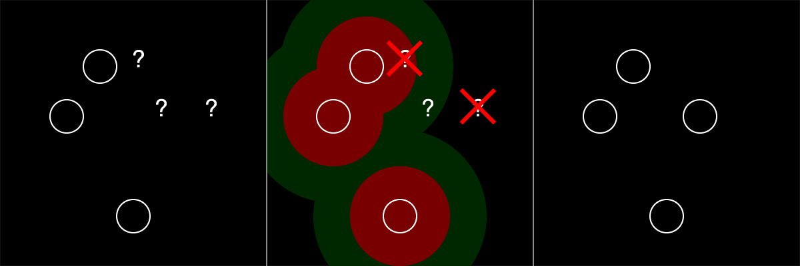

# Homework Review

- Perlin Noise is often used to simulate natural forms. Choose a work that demonstrates this. Discuss.
- Choose a work that combined elements from a previous week with noise. Discuss.
- The challenge is still not a competition, but who won?
- Choose a work that you 1) like and 2) don't know how how it was made. Describe what you see.
TBD

#### Today's Groups
TBD


# Today's Learning Objectives
- Practice analyzing form.
- Introduce and practice strategizing procedural generation systems.
- Introduce some common methods for aesthetically arranging points on a plane.
- Introduce common considerations when creating procedural generation systems.

# Assignment
Keep Sketching!

This is the last week of the "Foundation" unit. Look back at the topics covered so far: tile systems, using random, user parameters, using noise, and now thinking strategically.

This week I encourage you to build a more complex sketch, posting work in progress as you go.


## Reading + Viewing Assignment

[Procedural Content Generation in Games](http://pcgbook.com/) is a collection of research in the field of procedural game content. It covers many interesting topics including dungeon+maze generation, fractals, L-systems, generating rules/mechanics, and mixing proc-gen and human-authored content.

**Read:** [PCG Book, Chapter 1](http://pcgbook.com/wp-content/uploads/chapter01.pdf)

[Game Maker's Toolkit](https://www.youtube.com/channel/UCqJ-Xo29CKyLTjn6z2XwYAw) is a Youtube channel that features high-quality video essays on game design.

**Watch:** [GMT: Spelunky](https://www.youtube.com/watch?v=Uqk5Zf0tw3o)

If you want to play Spelunky, the original version (not the HD Remake) is free.

**Play (Optional):** [PC](http://spelunkyworld.com/original.html), [Mac](https://forums.tigsource.com/index.php?topic=28467.0)

## Special Assignment
Don't forget to sign up for orientations for the Laser Cutter and 3D printer.

**You must complete orientations for the Laser Cutter and 3D Printer before spring break!**

## Challenge: Hand Off
- Part 1: Create a sketch. Post the output. Hand the code to someone else.
- Part 2: Receive code from someone else. Modify it. Post the output.


# Computational Form Strategies

So far we've been looking at low-level, tactical topics like how to use `random()` and `noise()`. Achieving specific, complex results requires looking at problems from at a higher level. You must first have a clear understanding of the effect you would like to achieve, and then begin to plan a series of steps to reach your goal.

How might you make something like this?


As you work in computational form. You will find than many problems involve the techniques composed in different ways. Hopefully you are already seeing that the techniques we have already discussed are common building-blocks that can be used to create a wide array of forms. This trend will continue as we explore other tools and media.

There are many techniques that are widely used in math, physics, or game programming that provide further building-blocks: brownian motion, noise sampling, L-systems, neural nets, turtles, Markov chains, poisson-disc sampling, particle systems, fractals, metaballs.

# Placing Points on a Square

Today, we will be looking at a single problem domain: placing points on a square. There are countless strategies we might use to place the points depending on the look we want to achieve.


Study each example above:
- How does each example compare to the others?
- What characteristics could be used to group similar examples?
- What kind of plan might you try to achieve each example?


There are many techniques one may use when scattering points. The examples above were made by composing the following few techniques in different ways.

## Random Placement
Place each point at a random location on the square.

```
// psudeocode
...
x = random() * width;
y = random() * height;
...
```

## Noise Placement
Place each point at a location determined by a noise lookup.

- Because noise is center biased, the results will center biased.
- This technique allows you some control over the proximity of successive points.

```
// psudeocode
...
x = noise(i * frequency, 0) * w;
y = noise(i * frequency, 1000) * h;
...
```

## Grid Placement
Place points in the center points of grid squares. One way to do this is a nested loop.

```
// psudeocode
...
for (row = 0; row < grid_rows; row++) {
	for (col = 0; col < grid_cols; col++) {
		x = (row + .5) / grid_size * w;
		y = (col + .5) / grid_size * h;
        ...
	}
}
...
```

## Cull Placement
Place points randomly, but reject a point if it is too close to an existing point and/or too far from all existing points.



## Tile Placement
Create hand-made (or generated) arrangements of points. Copy these arrangements onto different locations on the square.

- Use this technique or one like it to combine hand-made and procedural design.


## Random Displacement
Given a set of points, offset the location of each point a random amount.
```
// psudeocode
...
x = x + random() * width;
y = y + random() * height;
...
```

## Noise Displacement

Displace each point at by an amount determined by a noise lookup.

- This technique allows for nice control over the frequency of displacement.
- Can be used to create wave-like effects.

```
// psudeocode
...
x = x + noise(i * frequency, 0) * w;
y = x + noise(i * frequency, 1000) * h;
...
```

## Relaxation Displacement

Find pairs of points that are near each other. Move them towards or away from each other a small amount. This technique is often applied several times with small movements this avoids the problem of pushing a point away from one, but then into another.

- This technique can be used to push points apart to some minimum distance.
- This technique can also be used to pull points together if they are near each other.


## Noise Culling

Sample noise based on the location of the point. Use the sampled value to determine if the point should be culled (discarded).

- This technique leaves points in the light (or dark) areas of the noise.


# Properties of PCG System
When designing a procedural generation system there are several properties to consider. The following properties are borrowed from [PCGBook: Chapter 1](http://pcgbook.com/wp-content/uploads/chapter01.pdf)

## Speed

- How fast does your program need to run?
- Is it okay if takes a very long time to complete?
- Many times a faster running program is harder to code and understand.
- A frame of VR content needs to be rendered in under 10ms, and a short pre-rendered animation may take days to render.

## Reliability

- Does your program need to produce a good result every time?
- Are results shown directly to your audience, or will you have the opportunity to edit?

## Controllability

- Does your program expose any user parameters?
- Do you want explore the parameter space manually?
- Do you want to have tight control over the results or should everything work automatically?

## Expressivity and Diversity

- How much apparent range does your system have?
- Does everything look same-y?
- Is it okay for your output to be completely wild or does it need to satisfy some constraints?
- If you are exposing parameters, do they allow for meaningful control?


## Creativity and Believability

- Do you want your results to look natural or hand-made?
- Is it okay for them to look "computer-y"?
- If your system is generating variations on something that already exists, how closely do you want to copy the original?

## Repeatability

- Do you need the ability to generate the same result more than once?


# Miscellaneous Links
- [Palm Generator](http://davideprati.com/)
- [bl.ocks.org Poison-Disc](https://bl.ocks.org/mbostock/19168c663618b7f07158)
- [bl.ocks.org Poisson-Disc II](https://bl.ocks.org/mbostock/dbb02448b0f93e4c82c3)
- [Devmag.org Poisson Disk](http://devmag.org.za/2009/05/03/poisson-disk-sampling/)
- [Points on a Sphere](https://www.jasondavies.com/maps/random-points/)
