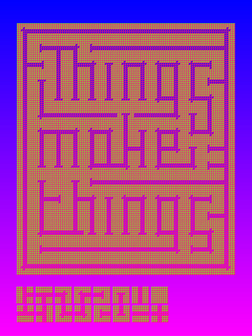

# Tile Set Design Examples

## Josef Albers - Bauhaus Lettering Set - 1926-31

[Piece @ Moma](http://www.moma.org/collection/works/2724)[Joseph Albers @ Moma](http://www.moma.org/collection/artists/97?locale=en)

## Anni Albers

[The Josef & Anni Albers Founation](http://www.albersfoundation.org/), [MOMA](http://www.moma.org/collection/artists/96?=undefined&page=1)

## Pauline Gorelov

[Artist's Site](http://www.paulinegorelov.com/)

## Chris Clark

[Artist's Site](http://www.chris-clarke.co.uk/)

## Jessica Svendsen - Yale Architecture Lecture Series Poster - 2015

[Artist's Site](http://jessicasvendsen.com/)
[100 Days with Josef Müller-Brockmann](http://jessicasvendsen.com/100-Days-with-Josef-Muller-Brockmann)

## We Are Plural

[Artist's Site](http://weareplural.com/work/typeforce-01/2/)

## Nintendo

## Darryl Brown

[Artist's Site](http://darryldesigns.blogspot.com/2012/01/handmade-modular-type.html)

## Unknown

## Adomas Bruzga

