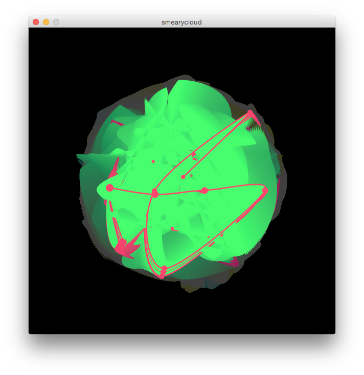

# Procedurally Generated Image Examples

### Jean Arp - Collage with Squares Arranged According to the Laws of Chance - 1917

### James Paterson (Presstube) - Page 0 (Detail) - 2004

- [Page 0](http://presstube.com/project.php?id=217)
- [Presstube Old Site](http://presstube.com/projects.php?pt_pp=18&&pp=all)

### Joshua Davis (Praystation) - Various

- [Artist's Site](http://www.joshuadavis.com/)

### Jared Tarbell (Complexification) - Substrate and Bubble Chamber - 2003

- [complexification](http://www.complexification.net/)
- [substrate](http://www.complexification.net/gallery/machines/substrate/index.php)
- [bubble chamber](http://www.complexification.net/gallery/machines/bubblechamber/)

### Dave Bollinger

- [Artit's Photostream](https://www.flickr.com/photos/davebollinger/)

<!-- ### JK Keller - Echo #12 - 2009

[Arist's Site](http://jk-keller.com/) -->

### Laurie Waxman (Parsons 2016) - Alphabet Iterations - 2015

[Arist's Site](http://lauriewaxman.com/)

### Greg Schomburg - Smeary Cloud Study - c. 2015

[Source](https://github.com/gschomburg/sketches/tree/master/smearycloud)
[Pencils](http://s3iz.com/index_flourish.html)

### Cellar Door Games - Rogue Legacy - 2013

[Rogue Legacy](http://roguelegacy.com/)
