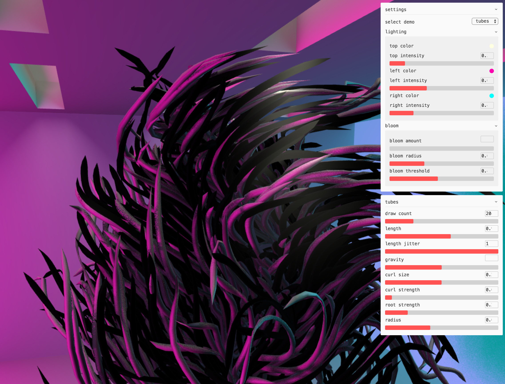
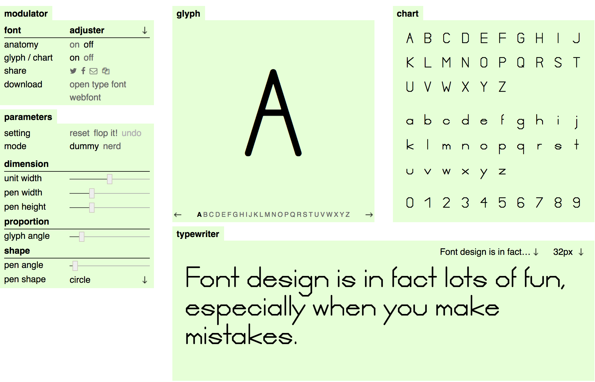
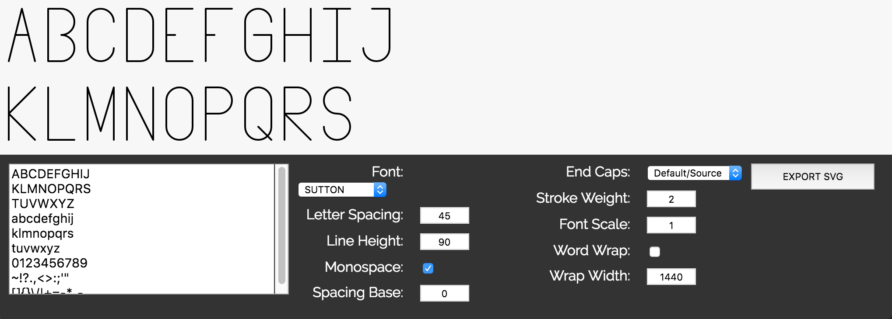
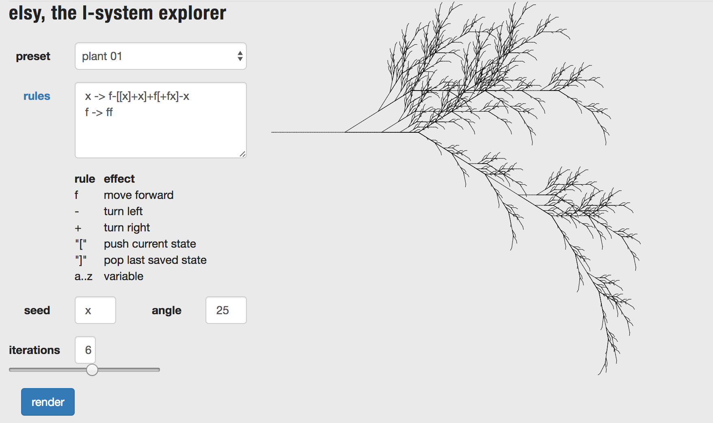
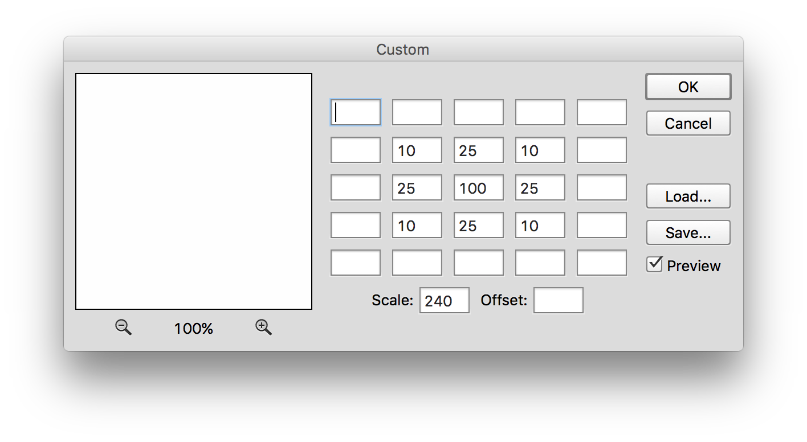

# Parameter Examples
Parameters are factors of a system that are exposed. Exposing parameters allows artists and designers to create systems that can be controlled by others.

### Zaha Hadid - Heydar Aliyev Center
.jpg?1384455904)
.jpg?1384455904)
[archdaily.com: Zaha Hadid Architects](http://www.archdaily.com/448774/heydar-aliyev-center-zaha-hadid-architects),
[Zaha Hadid](http://www.zaha-hadid.com/),
[Wikipedia: Parametricism](https://en.wikipedia.org/wiki/Parametricism)

### Kuva.io - Hair

[Kuva.io: Hair](https://www.kuva.io/hair-simulation/)

### Makehuman

### Droftarts - Parametric Pulley

[Thigiverse: Parameteric Pulley](http://www.thingiverse.com/apps/customizer/run?thing_id=16627&code=65885a90cc68e3e23b0b36718f8b4242)

### metaflop - modulator

[metaflop: modulator](http://www.metaflop.com/modulator/font/pQkUOJOPk8)

### Greg Schomburg - Gregfont

[gregschomburg.com: gregfont](http://gregschomburg.com/gregfont/)

### plastaq - elsy

[plastaq: elsy](http://www.plastaq.com/elsy/)

### Adobe Photoshop - Custom Filter

<!--
### edankwan.com - The Spirit
[edankwan.com: The Spirit](http://edankwan.com/experiments/the-spirit/)

Substance Painter Cairn Rocks
 -->
